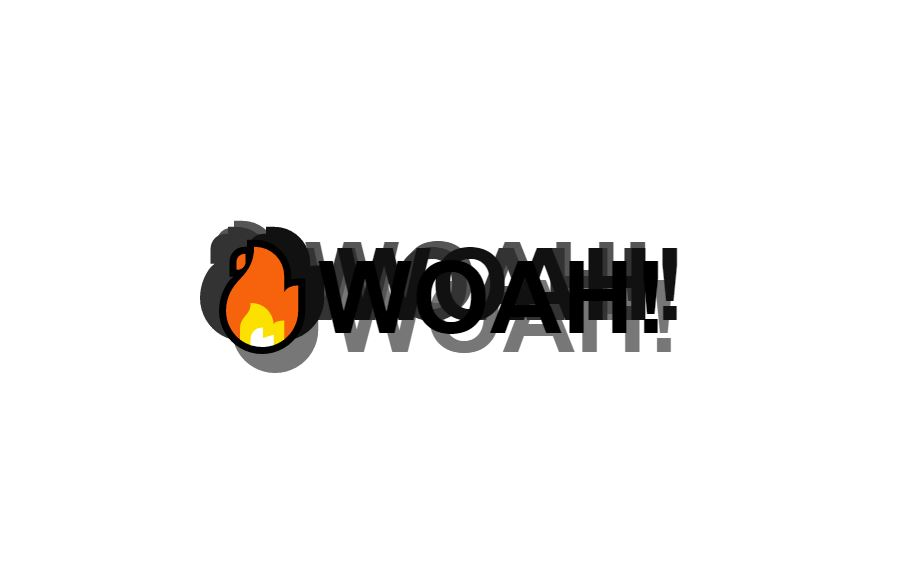

# mouseshadow

This is project 16 in Wes Bos' JavaScript 30 course.  This week we built a dynamic text shadow that follows the opposite of the mouse, almost giving the project that the mouse is the light casting a shadow. The project uses a basic function to populate the CSS Shadow.  I found a way to save a of lines of JavaScript by using clientX and clientY instead of offsetX and offsetY.  If you're interested in doing the project yourself, you can find the lesson <a href="https://www.youtube.com/watch?v=zaz9gLI-Xac&list=PLu8EoSxDXHP6CGK4YVJhL_VWetA865GOH&index=16">here.</a>

